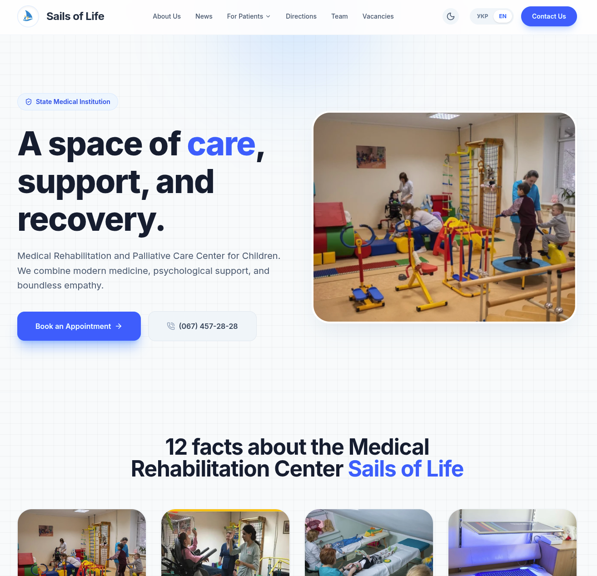

# 🏥 Website of the Municipal Non-Profit Enterprise "Center for Medical Rehabilitation and Palliative Care for Children" of the Zhytomyr Regional Council (Medical Center "Sails of Life")

[](https://opensource.org/licenses/MIT)
[](https://nextjs.org/)
[](https://tailwindcss.com/)
[](https://www.typescriptlang.org/)
[](https://www.framer.com/motion/)
[](https://nodejs.org/)
[](https://pages.cloudflare.com/)
[](https://github.com/BrownyOFF/clinic)

[Українська версія тут 🇺🇦](./README.md)

---

### 🔗 Links
- **Live Site:** [vitrylazhyttia.com.ua/en](https://vitrylazhyttia.com.ua/en)
- **Developer:** [Tymur Halas](https://github.com/BrownyOFF)

---

## 📋 Table of Contents
1. [About the Project](#-about-the-project)
2. [Key Features](#-key-features)
3. [Hosting and Infrastructure](#-hosting-and-infrastructure)
4. [Architecture and Operation Principle](#-architecture-and-operation-principle)
5. [Installation and Launch](#-installation-and-launch)
6. [Project Structure](#-project-structure)
7. [Development Rules](#-development-rules-code-style)
8. [Contributing](#-contributing)
9. [License](#-license-and-copyright)

---

## 📌 About the Project



This project is the **official website** for the **Municipal Non-Profit Enterprise "Center for Medical Rehabilitation and Palliative Care for Children" of the Zhytomyr Regional Council** (also known as Medical Center "Sails of Life").

The site solves the problem of providing patients and their families with quick and convenient access to critical information about rehabilitation services, documents, and the institution's specialists. The project was developed with a focus on high performance, SEO optimization for medical queries, and full responsiveness across all devices.

---

## ✨ Key Features

- 🌍 **Full Bilingual Support (UA/EN) & SEO:** 100% static content and SSR with independent manual routing for maximum control over SEO metrics.
- ⚡ **Maximum Speed:** Built with Next.js 16+, Server Components, and Edge Runtime for near-instant load times and excellent Core Web Vitals.
- 📬 **Edge Forms:** Registration forms run on Cloudflare Workers, sending notifications to Telegram and duplicating to Google Sheets/Email.
- 🛡️ **Anti-spam Protection:** Built-in "Honeypot" system to block bots without intrusive captchas.
- 🌙 **Dark Theme:** Full support for system and manual theme switching (Dark/Light) with smooth transitions.
- 🗺️ **Interactive Map:** Google Maps API with custom Advanced Markers for easy location finding.
- 🎭 **Smooth UI:** High-quality interface animations powered by Framer Motion.

---

## ☁️ Hosting and Infrastructure

The website is deployed on the **Cloudflare** platform (Cloudflare Pages / Workers).
This provides a global CDN, Edge Runtime for API routes, and automated SSL management, ensuring high availability and security.

---

## 🏗 Architecture and Operation Principle

The website is built on **Next.js 16.2+** using the **App Router**.

### 1. Server-Side Rendering (SSR) & Server Components
The architecture allows components to be rendered on the server by default, delivering ready-made HTML to the client. This dramatically improves loading speed and SEO. The `"use client";` directive is used strictly for interactivity.

### 2. Multilingualism (i18n)
We use **manual routing** without heavy localization libraries. The primary version is in `app/`, and the English version is in `app/en/`. Components are duplicated (`Header.tsx` / `HeaderEn.tsx`) for total control over content and design without runtime overhead.

### 3. Content Management (Databaseless)
All static content (news, vacancies, team, medical directions, FAQ, paid services, bank details and needs) is stored locally in typed **TypeScript files** (`app/data/`). This guarantees zero database response time, absolute resistance to database breaches, and keeps page code clean.

### 4. Form Processing & Anti-spam
Feedback forms operate via a secure API route on Cloudflare Edge. The built-in **Honeypot** system (hidden `bot_check` field) effectively filters out spam bots without bothering real users.

---

## 🚀 Installation and Launch

### Prerequisites
- Node.js (recommended version `^20.18.0` LTS)
- npm or **pnpm** (recommended)
- Cloudflare account (for deployment)

### 1. Cloning and installation
```bash
git clone https://github.com/BrownyOFF/clinic.git
cd clinic
npm install # or pnpm install
```

### 2. Environment Variables
Copy the example configuration file and add your keys:
```bash
cp .env.example .env.local
```
Open `.env.local` and fill in the required data (Telegram Token, Google Maps API Key, etc.).

### 3. Launch
```bash
npm run dev # Development
npm run build # Build for production
```

---

## 📂 Project Structure

```text
app/
├── api/             # Edge API routes (forms, Telegram/Google Script)
├── components/      # UI components (Header, Footer, Hero, Map, etc.)
├── data/            # Local content data (news.ts, team.ts, directions.ts, vacancies.ts, faq.ts, services.ts, help.ts)
├── en/              # English version (mirrored routing)
├── dlya-patsiyenta/ # "For Patient" section (documents, services, rehabilitation)
├── komanda/         # "Team" section
├── kontakty/        # "Contacts" section
├── napryamky/       # "Directions" section
├── novyny/          # "News" section (dynamic [slug] routing)
├── pro-nas/         # "About Us" section
├── vakansiyi/       # "Vacancies" section
└── layout.tsx       # Root layout, metadata and SEO
public/              # Static assets (images, documents)
```

---

## 📝 Development Rules (Code Style)

1. **TypeScript:** Strict typing is mandatory. Avoid `any`, use `interface` for props and data models, and use strict types for event handlers (e.g., `FormEvent<HTMLFormElement>`).
2. **Tailwind CSS:** Use Tailwind v4 classes for all styling. `dark:` support is mandatory.
3. **i18n Synchronization:** When changing the structure of a UA component, make sure to update its EN counterpart. Also, synchronize the localization files in `app/data/` (UA files and their counterparts with the `En` suffix).
4. **Naming:** Code is written exclusively in English. Comments are in Ukrainian.
5. **Data Extraction:** Static lists and text blocks should not be hardcoded in JSX. Extract them to appropriate modules in `app/data/`.

---

## 🤝 Contributing

We **warmly welcome Pull Requests from the community!** If you would like to help:
- Improving translations (especially medical terminology).
- Accessibility (A11y) fixes.
- Performance and SEO optimizations.
- Fixing discovered bugs.

The main development branch is `main`. Please ensure the project passes linting before creating a PR.

---

## 📄 License and Copyright

- **Code:** Distributed under the [MIT License](LICENSE).
- **Content:** All branding elements, logos, patient photographs, and specific textual content are the intellectual property of the institution. Use of these materials without official permission is prohibited.
