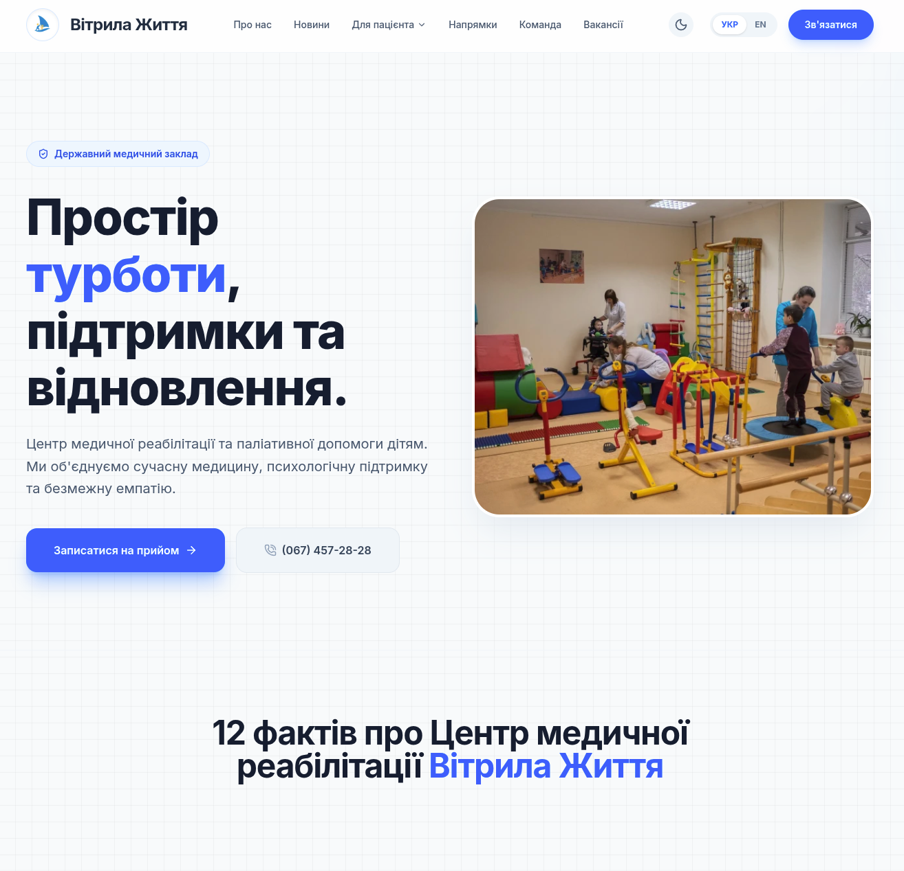

# 🏥 Сайт КНП «Центр медичної реабілітації та паліативної допомоги дітям» Житомирської обласної ради (Медичний центр "Вітрила життя")

[](https://opensource.org/licenses/MIT)
[](https://nextjs.org/)
[](https://tailwindcss.com/)
[](https://www.typescriptlang.org/)
[](https://www.framer.com/motion/)
[](https://nodejs.org/)
[](https://pages.cloudflare.com/)
[](https://github.com/BrownyOFF/clinic)

[English version here 🇬🇧](./README.en.md)

---

### 🔗 Посилання
- **Живий сайт:** [vitrylazhyttia.com.ua](https://vitrylazhyttia.com.ua/)
- **Розробник:** [Tymur Halas](https://github.com/BrownyOFF)

---

## 📋 Зміст
1. [Про проект](#про-проект)
2. [Основні можливості](#основні-можливості)
3. [Хостинг та Інфраструктура](#хостинг-та-інфраструктура)
4. [Архітектура та Принцип роботи](#архітектура-та-принцип-роботи)
5. [Встановлення та Запуск](#встановлення-та-запуск)
6. [Структура проекту](#структура-проекту)
7. [Правила розробки](#правила-розробки-code-style)
8. [Внесок у проект](#внесок-у-проект)
9. [Ліцензія](#ліцензія-та-авторське-право)

---

## 📌 Про проект



Цей проект — **офіційний веб-сайт** для **Комунального некомерційного підприємства «Центр медичної реабілітації та паліативної допомоги дітям» Житомирської обласної ради** (також відомого як Медичний Центр "Вітрила життя").

Сайт вирішує проблему швидкого та зручного доступу пацієнтів та їхніх родин до критичної інформації про реабілітаційні послуги, документи та фахівців закладу. Проект розроблено з акцентом на високу продуктивність, SEO-оптимізацію для медичних запитів та повну адаптивність під будь-які пристрої.

---

## ✨ Основні можливості

- 🌍 **Багатомовність (UA/EN) та SEO:** 100% статичний контент та SSR з незалежним ручним роутингом для максимального контролю над SEO-показниками.
- ⚡ **Швидкість:** Використання Next.js 16+, Server Components та Edge Runtime забезпечує миттєве завантаження та відмінні показники Core Web Vitals.
- 📬 **Edge Forms:** Форми запису працюють через Cloudflare Workers, надсилаючи сповіщення в Telegram та дублюючи в Google Sheets/Email.
- 🛡️ **Захист від спаму:** Вбудована система "Honeypot" для блокування ботів без нав'язливих капч.
- 🌙 **Темна тема:** Повна підтримка системної та ручної зміни теми (Dark/Light) з плавними переходами.
- 🗺️ **Інтерактивна карта:** Google Maps API з кастомними Advanced Markers для зручного пошуку закладу.
- 🎭 **Плавний UI:** Високоякісні анімації інтерфейсу за допомогою Framer Motion.

---

## ☁️ Хостинг та Інфраструктура

Сайт розгорнуто на платформі **Cloudflare** (Cloudflare Pages / Workers). 
Це забезпечує глобальну CDN, Edge Runtime для API-роутів та автоматичне управління SSL-сертифікатами, що гарантує високу доступність та безпеку.

---

## 🏗 Архітектура та Принцип роботи

Сайт побудований на базі **Next.js 16.2+** з використанням **App Router**.

### 1. Server-Side Rendering (SSR) та Server Components
Архітектура дозволяє за замовчуванням рендерити компоненти на сервері, віддаючи клієнту готовий HTML. Це кардинально покращує швидкість завантаження та SEO. Директива `"use client";` використовується строго дозовано лише там, де потрібна інтерактивність.

### 2. Багатомовність (i18n)
Ми використовуємо **ручний роутинг** без важких бібліотек локалізації. Основна версія знаходиться в `app/`, а англійська — в `app/en/`. Компоненти дублюються (`Header.tsx` / `HeaderEn.tsx`) для повного контролю над контентом та дизайном без runtime-накладних витрат.

### 3. Керування контентом (Databaseless)
Весь динамічний контент зберігається локально у статичних **TypeScript-файлах** (`app/data/`). Це гарантує нульовий час відгуку бази даних та абсолютну стійкість до зламів бази даних.

### 4. Обробка форм та Анти-спам
Форми зворотного зв'язку працюють через захищений API-роут на Edge Cloudflare. Вбудована система **Honeypot** (приховане поле `bot_check`) ефективно фільтрує спам-ботів, не створюючи перешкод для реальних користувачів.

---

## 🚀 Встановлення та Запуск

### Попередні вимоги
- Node.js (рекомендується версія `^20.18.0` LTS)
- npm або **pnpm** (рекомендовано)
- Обліковий запис Cloudflare (для деплою)

### 1. Клонування та встановлення залежностей
```bash
git clone https://github.com/BrownyOFF/clinic.git
cd clinic
npm install # або pnpm install
```

### 2. Налаштування змінних оточення
Скопіюйте приклад файлу налаштувань та додайте ваші ключі:
```bash
cp .env.example .env.local
```
Відкрийте `.env.local` та заповніть необхідні дані (Telegram Token, Google Maps API Key тощо).

### 3. Запуск
```bash
npm run dev # Розробка
npm run build # Збірка для продакшену
```

---

## 📂 Структура проекту

```text
app/
├── api/             # Edge API роути (форми, Telegram/Google Script)
├── components/      # UI компоненти (Header, Footer, Hero, Map тощо)
├── data/            # Локальні дані контенту (news.ts, newsEn.ts)
├── en/              # Англійська версія сайту (дзеркальний роутинг)
├── dlya-patsiyenta/ # Розділ "Для пацієнта" (документи, послуги, реабілітація)
├── komanda/         # Розділ "Команда"
├── kontakty/        # Розділ "Контакти"
├── napryamky/       # Розділ "Напрямки"
├── novyny/          # Розділ "Новини" (динамічний роутинг [slug])
├── pro-nas/         # Розділ "Про нас"
├── vakansiyi/       # Розділ "Вакансії"
└── layout.tsx       # Головний макет, метадані та SEO
public/              # Статичні файли (images, documents)
```

---

## 📝 Правила розробки (Code Style)

1. **TypeScript:** Строга типізація обов'язкова. Уникайте `any`, використовуйте `interface` для пропсів.
2. **Tailwind CSS:** Використовуйте класи Tailwind v4 для всіх стилів. Обов'язкова підтримка `dark:`.
3. **i18n Синхронізація:** При зміні структури UA компонента, обов'язково оновіть відповідний EN аналог.
4. **Naming:** Код пишеться виключно англійською мовою. Коментарі — українською.

---

## 🤝 Внесок у проект

Ми з радістю приймаємо Pull Requests! Якщо ви хочете допомогти:
- Покращення перекладів (особливо медичної термінології).
- Виправлення доступності (Accessibility/A11y).
- Оптимізація продуктивності та SEO.
- Виправлення знайдених багів.

Основна гілка — `main`. Перед створенням PR, будь ласка, переконайтеся, що проект проходить перевірку лінтером.

---

## 📄 Ліцензія та Авторське право

- **Код:** Поширюється за ліцензією [MIT License](LICENSE).
- **Контент:** Усі елементи брендингу, логотипи, фотографії пацієнтів та специфічний контент є інтелектуальною власністю закладу. Використання цих матеріалів без офіційного дозволу заборонено.
